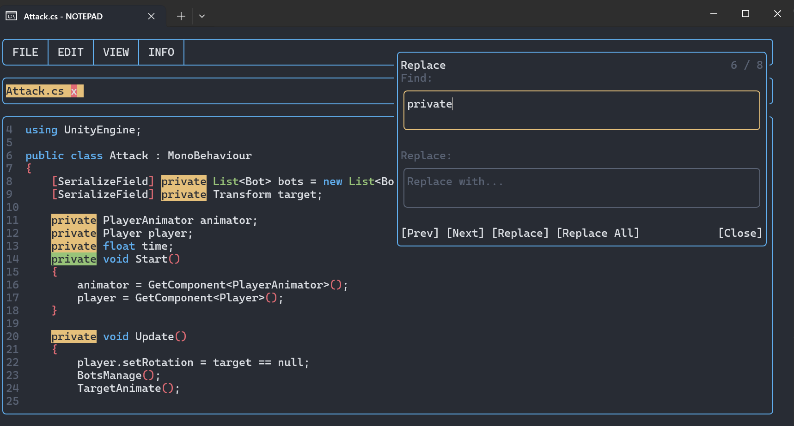
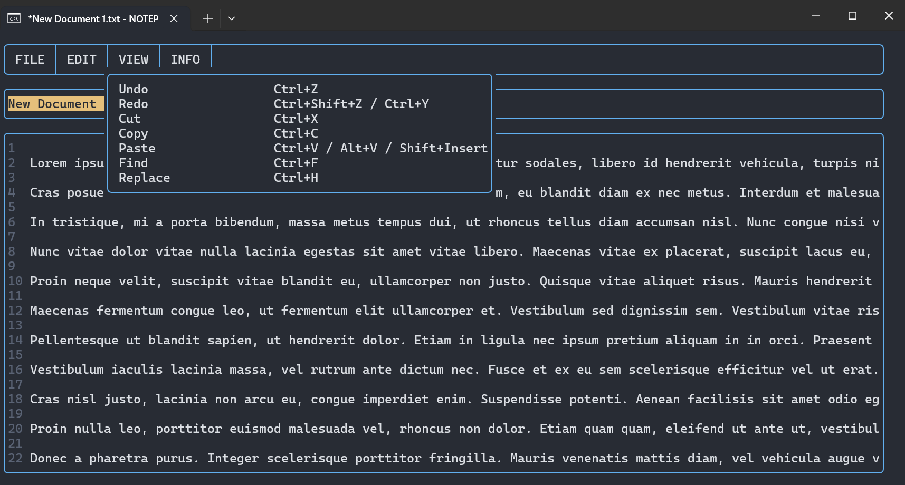

<h1>
  
  Rust-TUI-Notepad
</h1>

A terminal text editor written in Rust on top of `crossterm`.

This project is primarily a practical playground to learn:
- building a custom TUI layout and render pipeline
- editing text with selections, history, and search
- working with system clipboard, file dialogs, tabs, and recent files
- keeping a terminal app usable across different terminal hosts
- handling crash recovery in a terminal editor

Some features helped by OpenAI Codex.

## Preview

| Editor view | Documents/tabs view |
| --- | --- |
|  |  |

---

## Features

### Editor

- Multi-line text editing
- Keyboard navigation with arrows, `Home`, `End`, `PgUp`, `PgDn`
- Mouse cursor placement
- Mouse text selection with auto-scroll on viewport edges
- Vertical mouse wheel scrolling
- Horizontal scrolling with `Alt + wheel`
- Undo / redo
- Real system clipboard support
- Clickable links inside the document

### Documents and tabs

- Open file through native file dialog
- Save / Save As
- New virtual document with reserved path in app data
- Multi-document tab strip based on recent files
- Click tab to switch active document without forcing save
- Close document tab by clicking `x`
- Horizontal tab scrolling with mouse wheel on the tab strip
- Dirty state marker (`*`) per document tab
- Broken file entries are marked with `x` and can be removed on click
- "Open in Explorer" for the current file
- Unsaved-changes confirmation on close/exit across all dirty documents

### Session safety

- Automatic crash/session recovery snapshots
- Recovery restores:
  - text
  - cursor and selection
  - scroll position
  - undo / redo history
- Recovery snapshot is cleaned on normal exit

### Windows integration (`notepad_open_with`)

- Separate launcher binary: `notepad_open_with.exe`
- Accepts file path arguments and forwards them to `NOTEPAD.exe`
- Auto-registers itself in `HKCU\\Software\\Classes` for "Open with" and `.txt` ProgID entries
- Registers icon for associated `.txt` documents using the launcher's own executable icon
- Temporarily adjusts Windows Terminal settings (`Ctrl+V`, color scheme) and restores original settings after exit
- Launcher icon and app manifest are embedded into the `.exe` at build time from `assets/`

### Search and replace

- Side popup for `Find`
- Side popup for `Replace`
- Multi-line search query
- Match count and current match index
- `Next` / `Prev` navigation
- Replace current match
- Replace all matches
- Match highlighting inside the visible viewport
- Selected text is pushed into `Find` when opened

### Syntax highlighting

- Toggleable from `View -> Highlight Keywords`
- Generic language-agnostic keyword highlighting
- Separate colors for:
  - keywords
  - control-flow keywords
  - collection / vector-like types
  - numbers
  - strings
  - brackets
  - comments
- Supported comments:
  - `// ...`
  - `/* ... */`
  - `<!-- ... -->`

### Configurable shortcuts

- Hotkeys are stored in config as string bindings
- Users can remap shortcuts without recompiling
- Multiple shortcuts can be assigned to the same action

---

## Quick start

### Run from source

```bash
cargo run --bin NOTEPAD
```

Open a specific file directly:

```bash
cargo run --bin NOTEPAD -- "C:\\path\\to\\file.txt"
```

Run the Windows launcher from source:

```bash
cargo run --bin notepad_open_with -- "C:\\path\\to\\file.txt"
```

### Build release binaries

```bash
cargo build --release --bins
```

Artifacts:

- `target\\release\\NOTEPAD.exe` - main editor
- `target\\release\\notepad_open_with.exe` - Open With launcher with embedded icon/manifest

On Windows, icon embedding for `notepad_open_with.exe` requires `rc.exe` (Windows SDK) and `cvtres.exe` (Visual Studio Build Tools / MSVC tools).

### Using Open With on Windows

- Build `notepad_open_with.exe`
- In Explorer: right click a `.txt` file -> Open with -> Choose another app -> select `notepad_open_with.exe`
- After first launch, the launcher writes user-level (`HKCU`) registry entries for easier reuse and icon binding
- The launcher does not require administrator rights because it only writes to current-user registry hive

---

## Default hotkeys

- `Ctrl+N` - New file
- `Ctrl+O` - Open file
- `Ctrl+S` - Save file
- `Ctrl+Shift+S` - Save file as
- `Ctrl+E` - Open current file in Explorer / file manager
- `Ctrl+F` - Find
- `Ctrl+H` - Replace
- `Ctrl+Z` - Undo
- `Ctrl+Shift+Z` / `Ctrl+Y` - Redo
- `Ctrl+A` - Select all
- `Ctrl+C` - Copy
- `Ctrl+X` - Cut
- `Ctrl+V` / `Alt+V` / `Shift+Insert` - Paste
- `Enter` in Find - Next match
- `Shift+Enter` in Find / Replace - New line in the query
- `Esc` - Close Find / Replace
- `Ctrl+Click` or `Shift+Click` on a link - Open link

---

## Config and storage

The app stores its data in the standard application config location:

- Windows: `%APPDATA%\\notepad`
- Linux: `$XDG_CONFIG_HOME/notepad` or `~/.config/notepad`
- macOS: `~/Library/Application Support/notepad`

Files used by the app:

- `.config` - editor config, recent files, hotkeys, highlight toggle
- `documents/` - generated paths for new unsaved documents
- `recovery/session.json` - crash/session recovery snapshot
- `log.txt` - local log file

Example hotkey section:

```json
[
  { "action": "find", "shortcut": "Ctrl+F" },
  { "action": "replace", "shortcut": "Ctrl+H" },
  { "action": "paste", "shortcut": "Alt+V" }
]
```

---

## Notes / limitations

- This is a custom TUI editor, not a full parser-based IDE.
- Syntax highlighting is intentionally generic and rule-based.
- `Ctrl+V` behavior depends on terminal host; `Alt+V` and `Shift+Insert` are safer fallbacks.
- Control characters are sanitized on render to avoid breaking the terminal output.
- The project currently has no splits or plugin system.

---

## Project structure

- `src/app.rs` - event loop, layout orchestration, drawing
- `src/app_actions.rs` - app-level actions
- `src/app_dialogs.rs` - native dialogs
- `src/recovery_store.rs` - crash/session recovery persistence
- `src/text_buffer.rs` - editor buffer, search, history, selection, links
- `src/input.rs` - input state and command routing
- `src/shortcuts.rs` - configurable hotkey parser
- `src/syntax_highlight.rs` - generic syntax highlighting
- `src/panels/text_editor_panel.rs` - main editor panel
- `src/panels/search_panel.rs` - find / replace popup
- `src/panels/files_panel.rs` - tabs/recent files panel
- `src/panels/menu_panel.rs` - top menu
- `src/bin/notepad_open_with.rs` - Windows Open With launcher
- `build.rs` - Windows icon/manifest resource embedding for launcher
- `assets/text_document_icon.ico` - multi-size icon for launcher/doc association
- `assets/notepad_open_with.manifest` - Windows manifest embedded into launcher

---

## License

This project is dual-licensed under either of:

- Apache License 2.0 ([LICENSE-APACHE](LICENSE-APACHE))
- MIT license ([LICENSE-MIT](LICENSE-MIT))

at your option.

---

## Tech

- Rust
- `crossterm`
- `serde` / `serde_json`
- `cli-clipboard`
- `rfd`
